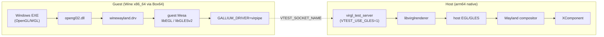

# Pad GL/VirGL 移植计划

> 状态: 🚧 待执行 | 前置: 音频链路已验证 ✅
>
> 目标: 在 HarmonyOS Pad (arm64, GLES-only) 上调通 Wine OpenGL/WGL → VirGL → 宿主 EGL/GLES 渲染链路。

## 核心认知

**Pad ≠ PC。** PC 上有桌面 OpenGL (`EGL_OPENGL_BIT`)，Pad 只有 `EGL_OPENGL_ES2_BIT` / `EGL_OPENGL_ES3_BIT_KHR`。

Wine 的 WGL API 需要从 EGL configs 枚举 pixel format。在 GLES-only 环境下：
- `ChoosePixelFormat` 失败 = EGL config 枚举不到 `EGL_OPENGL_BIT`
- 修复 = Wine WGL 走 GLES fallback：`WINEHUA_WGL_FORCE_GLES=1`
- `wglCreateContext` 失败 = context API 不匹配 → 需 EGL_OPENGL_ES_API



---

## 阶段一: 构建 Guest Mesa（x86_64 交叉编译）

Guest Mesa = Box64 模拟加载的 x86_64 Mesa EGL/GLES，使用 `virpipe` gallium 驱动。

```bash
docker exec winehua-dev bash -c "cd /data/src/winehua && bash scripts/build_ohos_guest_gfx.sh --mode virpipe --platform wayland"
```

**产物** → `build/guest_gfx_install/arm64-v8a/`:

| 文件 | 说明 |
|---|---|
| `lib/libEGL.so` | guest EGL 入口 |
| `lib/libGLESv2.so` | guest GLES2/3 实现 |
| `lib/dri/virgl_dri.so` | virpipe gallium 驱动 |
| `winehua-guest-gfx.env` | 环境变量 (GALLIUM_DRIVER, LIBGL_DRIVERS_PATH 等) |

**Guest env 关键变量** (由 `winehua-guest-gfx.env` 导出):

```text
GALLIUM_DRIVER=virpipe
LIBGL_DRIVERS_PATH=<guest_gfx>/lib/dri
EGL_DRIVERS_PATH=<guest_gfx>/lib/dri
__EGL_VENDOR_LIBRARY_DIRS=<guest_gfx>/lib
VTEST_SOCKET_NAME=<prefix>/graphics/virgl.sock
```

| **PC vs Pad 差异**: guest 只用 GLES API (`EGL_OPENGL_ES_API`)，不走 `EGL_OPENGL_BIT`。

---

## 阶段二: 宿主侧 Presenter 文件拷贝

从参考工程 `F:\Sample\WineHua\entry\src\main\cpp\` 拷贝 7 个文件:

| 文件 | 作用 |
|---|---|
| `graphics_types.h` | `FramePresenterPath` 枚举, `BackendCaps`, `DamageRect`, `ViewportRect` |
| `graphics_stats.h` | `GraphicsStats` 结构体 + `UpdateGraphicsAverage` |
| `frame_presenter.h` | `IFramePresenter` 抽象接口, `PresentFrameArgs/Result`, `BackendSelection` |
| `cpu_shm_presenter.h/.cpp` | CPU→SHM→GL Upload 渲染器 |
| `gl_compositor_presenter.h/.cpp` | GL Compositor 直通渲染器 |
| `surface_texture_cache.h/.cpp` | Surface 纹理缓存 (damage rect 增量) |
| `backend_detector.h/.cpp` | 运行时后端能力检测 (Auto/CpuShm/GlCompositor) |

**操作**: 直接文件拷贝到 `f:\WineHua\entry\src\main\cpp\`

---

## 阶段三: graphics_broker 扩展

用参考版本覆盖 `graphics_broker.h/.cpp`。

### 头文件变更 (`graphics_broker.h`)

```diff
+ #include "frame_presenter.h"

- enum class GraphicsBackend { Shm = 0, Virgl = 1 };
+ enum class GraphicsBackend { Auto = 0, Shm = 1, Virgl = 2 };

  struct GraphicsBackendState {
+     std::string backend;               // BackendName(active)
+     std::string presenter;             // FramePresenterPathName
+     bool fallbackActive;
+     bool damageUploadActive;
+     bool zeroCopyFramePath;
+     bool nativeBufferInUse;
+     BackendCaps caps;                  // virglAvailable, xcomponentEglAvailable ...
+     GraphicsStats stats;              // frameCount, cpuCopyBytes, glUploadBytes ...
  };

+ void SetPresenterOverride(std::optional<FramePresenterPath>);
+ std::optional<FramePresenterPath> GetPresenterOverride() const;
+ void ReportPresenterState(...);
+ std::vector<std::string> BuildWineEnvOverrides() const;
```

### 实现变更要点 (`graphics_broker.cpp`)

| Pad 关键逻辑 | 说明 |
|---|---|
| `GraphicsBackend::Auto` | 自动检测 virgl 可用性，不可用时 fallback 到 Shm |
| `SetPresenterOverride` | 允许强制使用特定 presenter (调试用) |
| `ProbeVirglRuntimeSmokeLocked` | virgl 冒烟测试：确保 socket + library + context 都 OK |
| `VTEST_USE_GLES=1` | **Pad 专用**: host virgl_test_server 只用 GLES |
| `EGL_PLATFORM=surfaceless` | virgl server 不需要真实 surface |

| **PC vs Pad 差异**: host virgl_test_server 设置 `VTEST_USE_GLES=1`，不依赖 `EGL_OPENGL_BIT`。PC 上可能有多余的 desktop GL config。

---

## 阶段四: CMakeLists.txt 更新

`entry/src/main/cpp/CMakeLists.txt` 的 `add_library(entry SHARED ...)` 新增:

```cmake
    backend_detector.cpp
    cpu_shm_presenter.cpp
    gl_compositor_presenter.cpp
    surface_texture_cache.cpp
```

已存在的链接库确认:

```cmake
target_link_libraries(entry PUBLIC
    libEGL.so           # host EGL (已存在)
    libGLESv3.so        # host GLES3 (已存在)
    libnative_window.so # XComponent surface (已存在)
    ...
)
```

---

## 阶段五: BOX64_EMULATED_LIBS

Pad/Box64 必须声明 guest EGL/GLES/Wayland 库作为 emulated libs，避免被 native linker 误加载:

```text
BOX64_EMULATED_LIBS=libEGL.so:libEGL.so.1:libGLESv2.so:libGLESv2.so.2:\
  libwayland-client.so:libwayland-server.so:libwayland-egl.so:libdrm.so
```

| **PC vs Pad 差异**: PC 不需要 `BOX64_EMULATED_LIBS`（没有 Box64 翻译层）。

---

## 阶段六: wine-data.zip 更新 + HAP 构建

```bash
# 1. 构建 guest Mesa (如果阶段一没做)
bash scripts/build_ohos_guest_gfx.sh --mode virpipe --platform wayland

# 2. 组装 (含 guest_gfx libs)
make assemble NATIVE_ARCH=arm64-v8a DEVICE_TYPE=pad

# 3. 或手动注入 guest_gfx 到 zip
cp -r build/guest_gfx_install/arm64-v8a/* build/staging/wine-data/guest_gfx/
cd build/staging/wine-data && zip -r rawfile/wine-data.zip .

# 4. HAP 构建 + 签名
hvigorw assembleHap -p buildMode=release

# 5. 安装
hdc -t <device> install -r entry-default-signed.hap
```

---

## 阶段七: 验证

### 准备

```bash
# 在 Pad 的 Z: 盘放测试文件
# winehua_graphics_smoke.exe 已在 wine/bin/x86_64-windows/ 中
```

### 启动测试

从 Wine 桌面双击 `winehua_graphics_smoke.exe`，或通过 broker 启动。

### 验证清单

| 步骤 | hilog 关键字 | 预期 |
|---|---|---|
| GraphicsBroker 启动 | `GraphicsBroker.*virglSocketReady=1` | socket 创建成功 |
| virgl_test_server | `VirglServerMain` | native child 监听 socket |
| guest libs 加载 | `guestReceiverPresent=true` | Mesa EGL/GLES 可用 |
| EGL config 枚举 | `egl configs total=... filtered=...` | 至少 1 个 GLES2/3 config |
| ChoosePixelFormat | `ChoosePixelFormat → <non-zero>` | WGL format 选中 |
| wglCreateContext | `created GLES2 context through WGL fallback` | context 创建 |
| 渲染帧输出 | `SwapBuffers`, `wl_surface.commit` | 画面到 XComponent |

### 常见失败排查

| 现象 | 优先检查 |
|---|---|
| guest libs 不存在 | `build_ohos_guest_gfx.sh` 是否成功 + 是否包入 zip |
| `ChoosePixelFormat = 0` | `WINEHUA_WGL_FORCE_GLES=1` 是否设置；EGL config 是否只有 GLES |
| `wglCreateContext` 失败 | EGL error；`BOX64_EMULATED_LIBS` 是否包含 libEGL/libGLES |
| virgl socket 不可达 | `VTEST_SOCKET_NAME` 路径；virgl_test_server 进程状态 |
| 画面不刷新 | Wayland surface commit；damage rect；presenter fallback |

---

## 排除范围

| 不迁移项 | 原因 |
|---|---|
| `virgl_child.cpp` | 参考工程也未实现，后续单独处理 |
| `homeDir` / Z:盘映射 改动 | 与 GL 无关，避免引入变量 |
| Desktop OpenGL (`EGL_OPENGL_BIT`) | Pad 不支持，一切走 GLES |

---

## 执行概要

```
1. build_ohos_guest_gfx.sh         → 构建 guest Mesa (x86_64/virpipe)
2. 拷贝 7 个 presenter 文件         → entry/src/main/cpp/
3. 覆盖 graphics_broker.h/.cpp      → Auto 模式 + GLES 专用
4. 更新 CMakeLists.txt              → 新增 4 个 .cpp
5. assemble + zip                   → 包入 guest_gfx libs
6. hvigorw + install                → HAP 部署
7. winehua_graphics_smoke.exe 验证  → WGL→VirGL→GLES E2E
```
